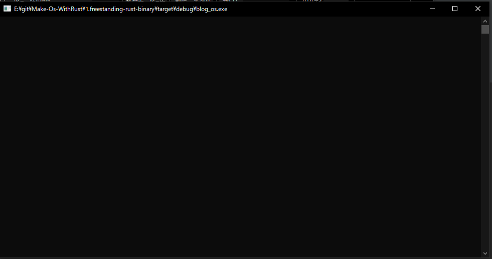
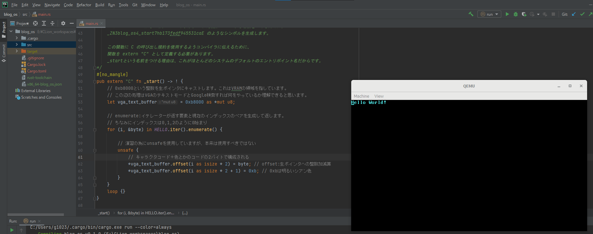

# 環境

    開発マシンOS Windows10

    rustup 1.23.1 (3df2264a9 2020-11-30)
    rustc  1.52.0-nightly (e37a13cc3 2021-02-28)
    toolchain nightly-2021-03-01-x86_64-pc-windows-msvc

## 参考にしたもの

https://os.phil-opp.com/ja/

## 1.フリースタンディングな Rust バイナリ
OSに依存しない実行バイナリです。

実装に当たって標準ライブラリの無効化を行っています。

このような条件下でどのように実装すれば実行バイナリが作れるのかがポイントです。

このバイナリは画面表示だけで何も行いません。

## 2.Rustでつくる最小のカーネル
１．で作成したプログラムをベースにカスタムターゲットの作成、 実行可能ファイルとブートローダの組み合わせ、VGAテキストバッファでHelloWorldの実行を行います。

QMENU上での実行の為のディスクイメージの作成にも触れています。

